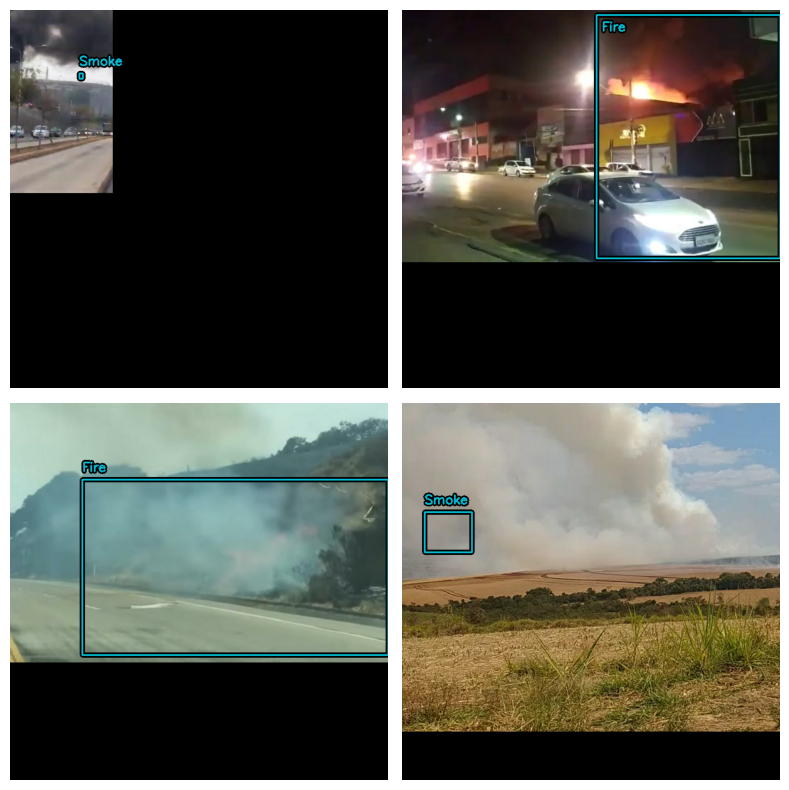
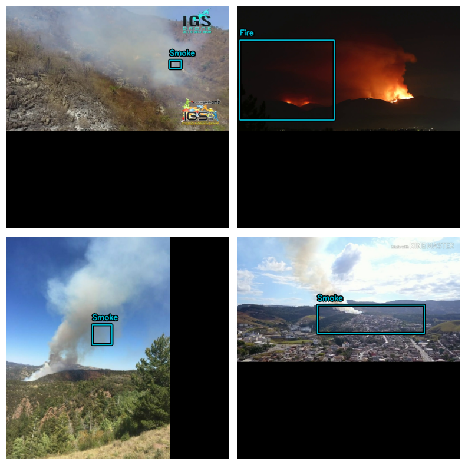

# Smoke_Fire_Detection_On_Edge_Devices
Towards Smoke and Fire detection via images using Deep Learning on resource constrained embedded devices. 

<!DOCTYPE html>
<html lang="en">
<head>
    <meta charset="UTF-8">
    <meta name="viewport" content="width=device-width, initial-scale=1.0">
    <title>Image Table</title>
    
</head>
<body>

<table>
    <tr>
        <td></td>
        <td></td>
        <td></td>
    </tr>
</table>

</body>
</html>

Developer: Ary Naim (anaim@unm.edu)

Advisor: Dr. Marios Pattichis (pattichi@unm.edu)

Deep learning libraries:

1) TensorFlow
2) Keras

INSTRUCTIONS:

1) RECOMMENDED START HERE

For the corresponding Google Collab go to: https://colab.research.google.com/drive/1d6qh1uXNrlptKafsonEZLDvkHJko7wD4?usp=sharing

2) For details instructions for refer to the PDF doc "Step by Step Guide for YOLOv8 Using Keras With Custom Datasets"

3) For code only refer to dir "code_only"

References:

1) Implementation was heavily based on:                         https://keras.io/examples/vision/yolov8/
2) Adding custom dataset via tensorflow:                        https://www.tensorflow.org/datasets/add_dataset
3) Dataset                                                      https://github.com/gaiasd/DFireDataset
4) Attemptiong to reproduce this paper however using YOLOv8:    
                                                                https://link.springer.com/article/10.1007/s00521-023-08260-2
                                                                https://www.researchgate.net/publication/361649776_An_automatic_fire_detection_system_based_on_deep_convolutional_neural_networks_for_low-power_resource-constrained_devices#fullTextFileContent
